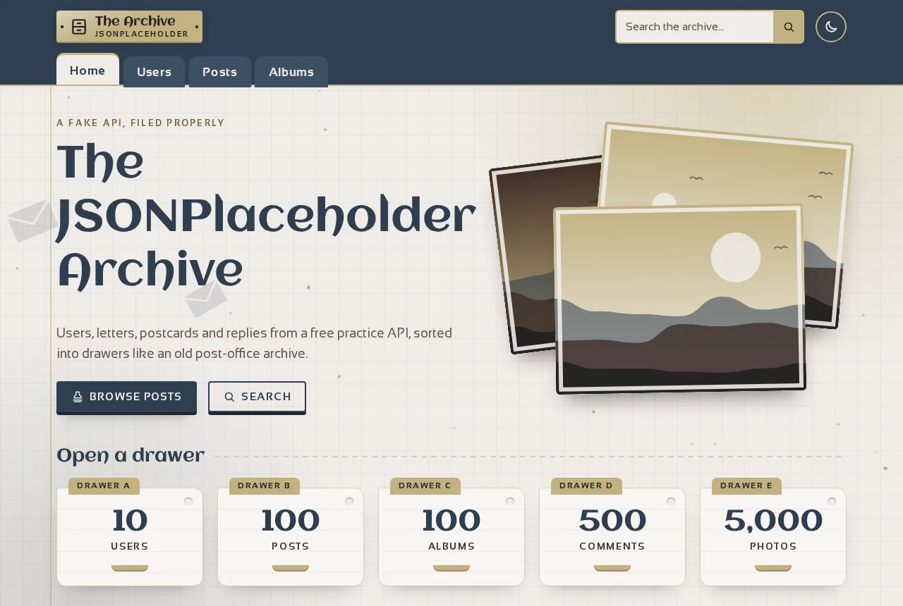
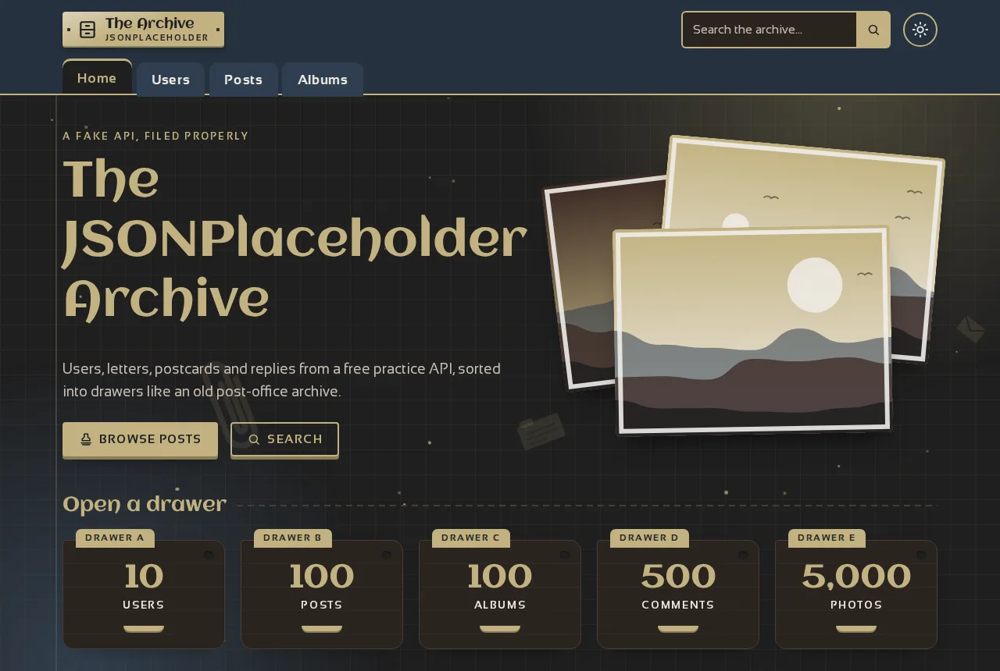
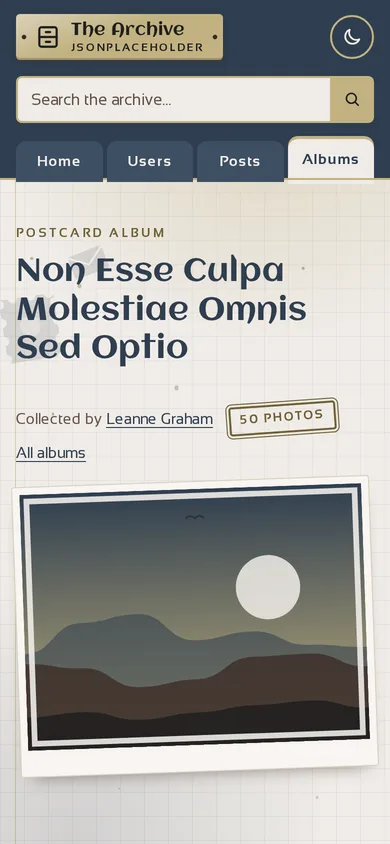

**English** · [Lietuviškai](README.lt.md)

# JSONPlaceholder Archive

A small multi-page website that shows the users, posts, albums and comments from the free [JSONPlaceholder](https://jsonplaceholder.typicode.com) API, filed like an old post-office archive.

**[Live demo](https://brutall100.github.io/jsonplaceholder-archive/)** · **[Source code](https://github.com/brutall100/jsonplaceholder-archive)**



<p>
  
  
</p>

## About

This was a course task on `fetch`, `async/await`, URL parameters and building the page from JavaScript. The site talks to a real REST API: each page asks for the data it needs and draws cards from it.

I then gave it its own look. The idea is a **lamp-lit archive**: index cards with folder tabs and punched holes, rubber-stamp badges and buttons, and postcards instead of photos.

## Features

- **Users**: all 10 people with post and album counts. Each user has a profile page with contact details, an address that opens Google Maps, their company, posts and albums.
- **Posts**: 100 posts with author and comment count, a "Show more" button and a filter by author (`posts.html?user=3`).
- **Post page**: the full text, the author and all comments (title, text, email).
- **Albums**: cover, author and photo count for each album. Each album page shows a gallery with a [PhotoSwipe](https://photoswipe.com) lightbox.
- **Search**: a search box in the header, plus a search page that works **without reloading** and can search one category (posts, users, comments, albums, photos) or all of them. Matches are highlighted. When nothing matches, the page says so.
- **Living background**: a slowly swaying desk-lamp glow, dust motes rising through the light and envelopes, stamps and postmarks drifting past. Phones get half as many particles, and it is turned off for `prefers-reduced-motion`.
- **Light and dark themes**: follows the system setting. The toggle remembers your choice, and the page does not flash while loading.
- **Micro-interactions**: buttons lift and press down with a ripple, and the stamp icon "thunks". Cards lift, content fades in as you scroll, and numbers count up.
- **Accessible**: "Skip to content" link, visible focus, labelled fields, alt texts, colour contrast checked against WCAG AA.
- **Generated artwork**: the photo links in JSONPlaceholder point to a service that no longer exists. Every photo is therefore drawn as a small SVG landscape from the palette. Avatars are SVG initials.

## Built with

- HTML, CSS (custom properties, grid, keyframe animations) and vanilla JavaScript (ES modules)
- [JSONPlaceholder](https://jsonplaceholder.typicode.com) REST API
- [PhotoSwipe 5](https://photoswipe.com) for the lightbox (bundled in `vendor/`)

**Palette** (all colours are CSS variables at the top of `css/style.css`):

| Colour | Hex | Used for |
|---|---|---|
| Paper | `#f0ece8` | light background, dark-mode text |
| Navy | `#2f3e4f` | header, headings, buttons (light) |
| Sand | `#c2b280` | folder tabs, lamp glow, accents, dark-mode links and buttons |
| Cocoa | `#3b2a24` | light-mode text |
| Ink | `#1f1f1f` | dark background |
| Deep sand | `#6f6035` | sand-coloured text on light backgrounds (plain sand is too light to read there) |

**Fonts:** [Aclonica](https://fonts.google.com/specimen/Aclonica) for headings, [Sansation](https://fonts.google.com/specimen/Sansation) for text.

## What I learned

- Loading several resources at once with `Promise.all` and joining them in the browser (for example, counting comments per post).
- Reading the `X-Total-Count` header to get a count without downloading everything.
- Passing data between pages with URL parameters (`user.html?id=2`).
- Building elements safely with `textContent` instead of `innerHTML`.
- Keeping a whole design in CSS variables so light and dark themes are just two sets of values.
- Animating only `transform` and `opacity`, so a busy background stays smooth.

## Run it locally

The site is static and needs no server code, database or `.env` file. ES modules do need to be served over `http://`, not opened as a file:

```bash
git clone https://github.com/brutall100/jsonplaceholder-archive.git
cd jsonplaceholder-archive
python3 -m http.server 8000     # or: npx serve .
```

Then open <http://localhost:8000>. An internet connection is needed for the API and fonts.

## Project structure

```
├── index.html, users.html, posts.html, albums.html
├── user.html, post.html, album.html, search.html
├── css/style.css          # palette tokens + all styles
├── js/
│   ├── api.js             # all API requests (with a small cache)
│   ├── layout.js          # header, tabs, search box, theme toggle, footer
│   ├── background.js      # living background
│   ├── effects.js         # ripple, reveal on scroll, count-up
│   ├── art.js             # SVG avatars and postcards
│   ├── dom.js, icons.js, theme-init.js
│   └── pages/             # one script per page
├── images/favicon.svg
├── vendor/photoswipe/     # PhotoSwipe (MIT)
└── docs/                  # screenshots
```

## Credits

- Data: [JSONPlaceholder](https://jsonplaceholder.typicode.com) by typicode.
- Lightbox: [PhotoSwipe](https://photoswipe.com) © Dmitry Semenov, MIT licence (see `vendor/photoswipe/LICENSE`).
- Fonts: Aclonica and Sansation from Google Fonts (SIL Open Font License).
- The task list comes from a JavaScript course assignment.

## License

[MIT](LICENSE) © 2026 brutall100
